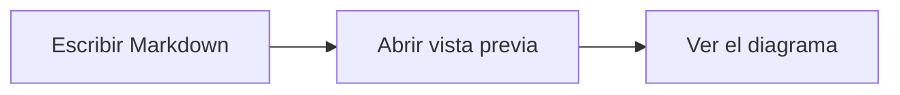
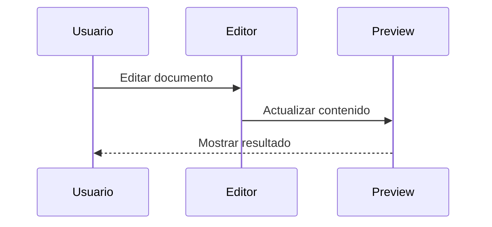

# Doc Craft

Vista previa de **Markdown** con diagramas Mermaid.

## Flujo

```mermaid
flowchart LR
  A[Escribir Markdown] --> B[Abrir vista previa]
  B --> C[Ver el diagrama]
```

## Secuencia

```mermaid
sequenceDiagram
  Usuario->>Editor: Editar documento
  Editor->>Preview: Actualizar contenido
  Preview-->>Usuario: Mostrar resultado
```

| Formato | Soporte |
| --- | --- |
| Markdown | Sí |
| Mermaid | Sí |
